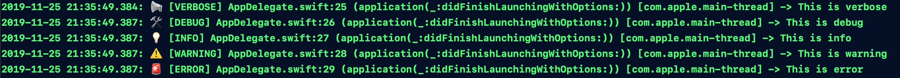

# EPLogger

[](https://cocoapods.org/pods/EPLogger)
[](https://cocoapods.org/pods/EPLogger)
[](https://cocoapods.org/pods/EPLogger)

## Use

1. `import EPLogger` in your `AppDelegate.swift`
2. copy & paste `public typealias Log = EPLogger.Log` into your `AppDelegate.swift` to top
3. Set Log level in to `didFinishLaunchingWithOptions` method
4. Done!


## Example
```swift

import UIKit
import EPLogger

// If you want to get import once and use it globally
public typealias Log = EPLogger.Log

@UIApplicationMain
class AppDelegate: UIResponder, UIApplicationDelegate {

    var window: UIWindow?

    func application(_ application: UIApplication, didFinishLaunchingWithOptions launchOptions: [UIApplication.LaunchOptionsKey: Any]?) -> Bool {
        
        // Set log level. default is verbose
        Log.congfig(level: .verbose)
        Log.verbose("This is verbose")
        Log.debug("This is debug")
        Log.info("This is info")
        Log.warning("This is warning")
        Log.error("This is error")

        return true
    )
}
```
  
  
It will print like this
  
  
<div>
    
</div>
  

## Requirements

Swift 5.0

## Installation

EPLogger is available through [CocoaPods](https://cocoapods.org). To install
it, simply add the following line to your Podfile:

```ruby
pod 'EPLogger'
```

## Author

Elon Park, sungwoon.park92@gmail.com

## License

EPLogger is available under the MIT license. See the LICENSE file for more info.
